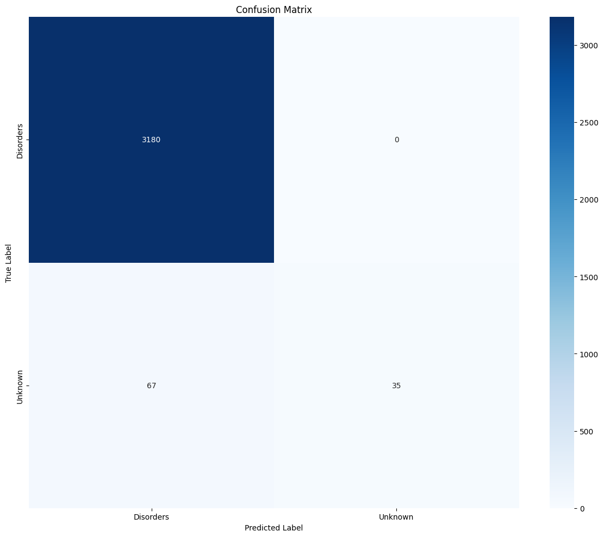

🩺 MedQuAD Chatbot

A Streamlit-based medical Q\&A chatbot that retrieves answers from the **NIH MedQuAD** dataset using semantic similarity and classification techniques. Built for educational use.

---

## 📌 Features

* Accepts user medical questions and returns the most relevant answers.
* Uses TF-IDF and cosine similarity for semantic retrieval.
* Classifies each question into semantic groups using a trained Random Forest model.
* Fast and interactive UI via Streamlit.

---

📁 Project Structure

TASK 3/
├── App/
│   ├── app.py                    # Streamlit chatbot frontend
│   ├── label_encoder.pkl         # Label encoder for semantic class prediction
│   ├── rf_tfidf_model.pkl        # Trained Random Forest model
│   └── tfidf_vectorizer.pkl      # TF-IDF vectorizer used for training/inference
│
├── MedQuAD/                      # 📚 Raw NIH MedQuAD QA datasets
│   ├── 1_CancerGov_QA/
│   ├── 2_GARD_QA/
│   ├── ...
│   ├── 12_MPlusHerbsSupplements_QA/
│   ├── LICENSE.txt
│   ├── QA-TestSet-LiveQA-Med-Qrels-...
│   └── readme.txt
│
├── Model/
│   ├── medquad_qa_data.json             # Parsed raw QA data  Original Accuracy : 69%
│   ├── medquad_qa_semantic_data.json   # QA data with semantic labels  Improved Accuracy: 97%
│   └── train_medquad_model.ipynb       # Model training and evaluation notebook
│
├── parse_medquad.py             # Script to process & convert raw MedQuAD into usable JSON
├── README.md                    # 📘 Project documentation
├── requirements.txt             # 🔧 Python dependencies


## 🚀 How to Run

1. **Install dependencies**

```bash
pip install -r requirements.txt
```

2. **Ensure the following files exist in the same directory as `app.py`:**

* `rf_tfidf_model.pkl`
* `tfidf_vectorizer.pkl`
* `label_encoder.pkl`
* `medquad_qa_semantic_data.json`

3. **Run the app**

```bash
streamlit run app.py
```

---

## 🧠 How It Works

### Training (from `train_medquad_model.ipynb`)

* **Data Source**: `medquad_qa_semantic_data.json`
* **Pipeline**:

  * Preprocess questions and semantic labels
  * Encode labels using `LabelEncoder`
  * Vectorize questions with `TfidfVectorizer`
  * Train `RandomForestClassifier` on vectorized data
  * Save the model and vectorizer with `joblib`

### Inference (from `app.py`)

* User types a medical question.
* App vectorizes the input and computes similarity with pre-vectorized MedQuAD questions.
* Top similar Q\&A pairs are displayed along with predicted semantic class.

---

## 📊 Model Results

### ✅ Accuracy

```text
0.9796
```

### 📋 Classification Report

| Label            | Precision | Recall | F1-Score | Support |
| ---------------- | --------- | ------ | -------- | ------- |
| Disorders        | 0.98      | 1.00   | 0.99     | 3180    |
| Unknown          | 1.00      | 0.34   | 0.51     | 102     |
| **Accuracy**     |           |        | **0.98** | 3282    |
| **Macro Avg**    | 0.99      | 0.67   | 0.75     | 3282    |
| **Weighted Avg** | 0.98      | 0.98   | 0.97     | 3282    |

### 🔷 Confusion Matrix



*(Dark blue indicates strong prediction alignment with "Disorders". Most "Unknown" entries are misclassified as "Disorders".)*

---

## ⚠️ Disclaimer

This tool is intended **only for educational and demonstration purposes**. It is **not a substitute for professional medical advice, diagnosis, or treatment.**

---

## 📊 Model Summary

* **Vectorizer**: TF-IDF (1–2 grams, 10k features)
* **Classifier**: Random Forest (200 trees, max depth 30)
* **Similarity Metric**: Cosine Similarity
